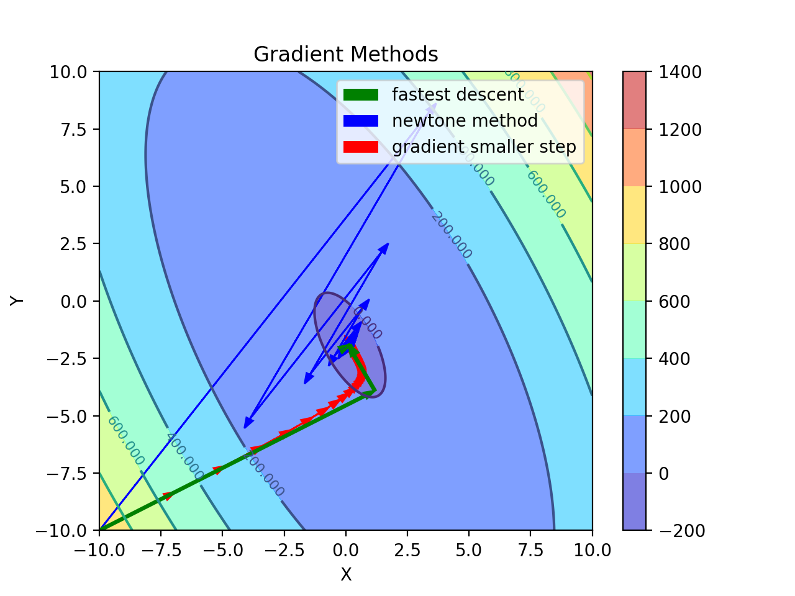
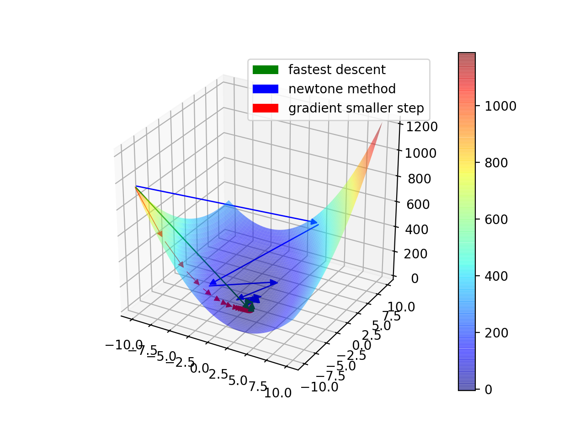

### Function optimization methods using Python 3

The code consists of the following search methods for finding minima of the univariate functions:
- Bisection method (also known as dichotomy method)
- Golden sections search
- Fibonacci search

The code consists of the following gradient descent methods for finding minima of the multivariate functions:
- Newton
- Fast descent (also known as Steepest descent)
- Descent with step-size decreasing

*Dependencies*:
- `numpy`
- `matplotlib`
- `mpl_toolkits`

To run the program, execute: `python3 main.py`

Snapshots of plots generated by the program:

Contour plot of the gradient methods:

3D-plot of the gradient methods:

